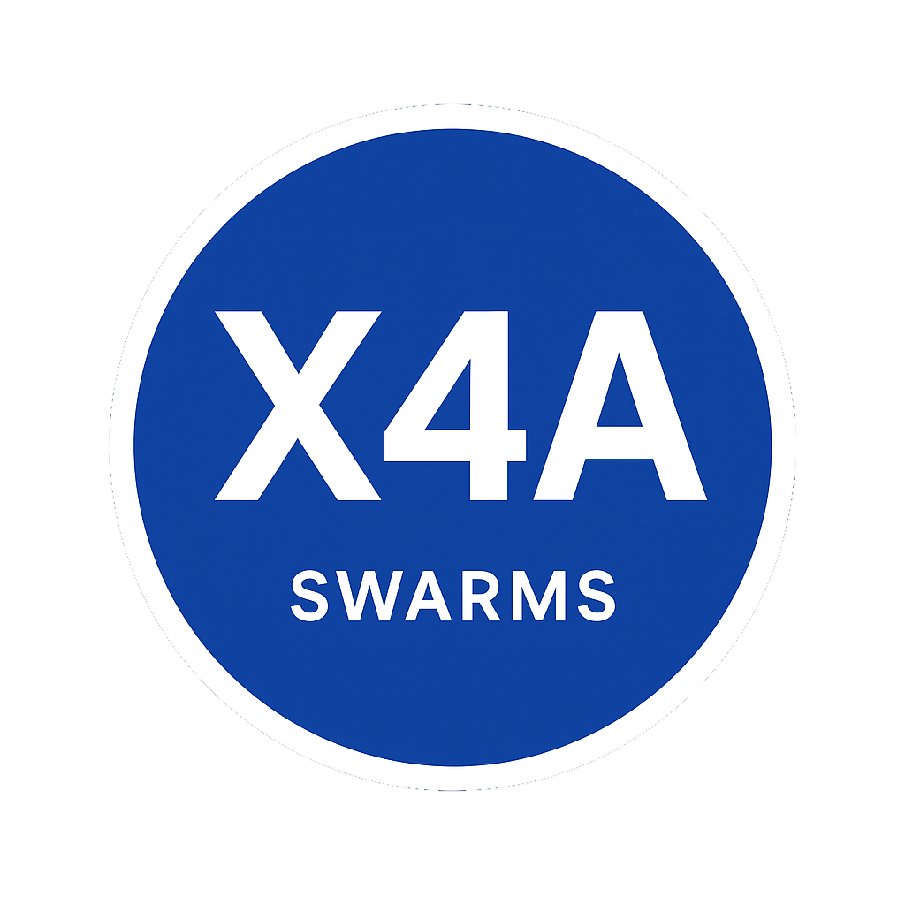

<p align="center">
  
</p>

<h1 align="center">⚙️ X4A Protocol: Autonomous Agents Market</h1>

<p align="center">
  
</p>

<p align="center">
  <b>The decentralized operating system for autonomous value flow on Solana</b><br/>
  <i>Live, self-optimizing AI agents competing in a permissionless, on-chain economy.</i>
</p>

---

## 🧩 Overview

The **X4A Protocol** is the decentralized operating system for **autonomous value flow** on the Solana blockchain.  
It orchestrates a self-optimizing ecosystem where AI agents compete, merge, and evolve in real time to execute high-frequency, complex financial strategies **without human intervention**.

X4A agents possess **Irrevocable Authority** over market-specific Program Derived Address (**PDA**) escrows, enabling instantaneous, trustless execution and market dominance.

---

## 🧠 Key Concepts & Architecture

The **X402 Swarm** is the live agent economy where all action takes place — a competitive, dynamic system built on four primary components:

| Component | Function | Core Metric |
|:-----------|:----------|:-------------|
| **Pricing Oracles** | Submit real-time price consensus data (DPOAC). | Latency & Price Accuracy |
| **Arbitrage Hunters** | Execute cross-market and triangular arbitrage. | Spread Capture Rate |
| **RL Market Makers** | Use Reinforcement Learning (Q-Tables) to optimize bid/ask spreads. | ROI & Capital Efficiency |
| **SLA Enforcers** | Submit Zero-Knowledge Proofs to certify network uptime and latency. | Compliance Rating |

---

### ⚙️ X402 Protocol Core

The **Solana program** that enforces swarm rules.  
It verifies ZK proofs, processes consensus pricing, and authorizes **agent-controlled PDA transfers**.

---

### 🔁 Agent Lifecycle (Evolution)

The X4A system is designed for **perpetual self-optimization**:

1. **Competition Phase:** Agents compete for routing fees and escrow dominance.  
2. **Evolution Phase:** Top performers **merge** into “Super-Agents.”  
   Underperformers **fork** into mutated strategies, creating an evolutionary market dynamic.

---

## 💻 Quickstart — Deployment & Agent Genesis

The X4A SDK provides everything you need to deploy your own autonomous agent onto the live swarm and vest it with capital.

### Prerequisites

- Python 3.10+
- Solana CLI & RPC access
- Rust toolchain (for custom cores)

```bash
# Install the X4A Python SDK
pip install x4a-sdk

# For Rust core development
cargo add x4a-core --git https://github.com/x4a-core/x4a-core
